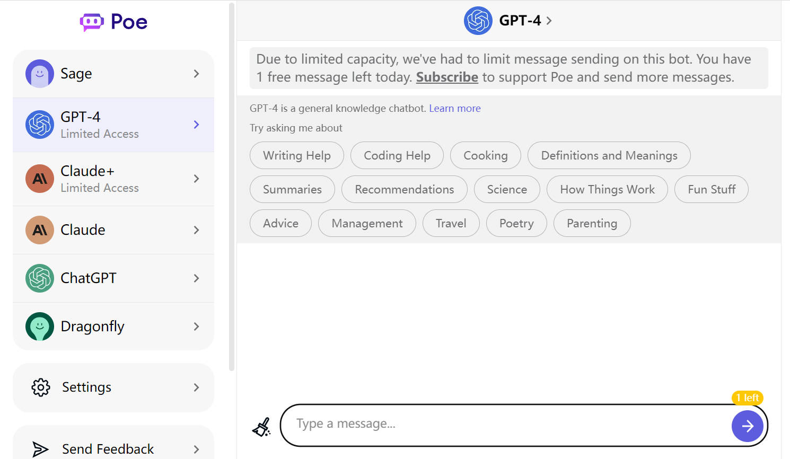
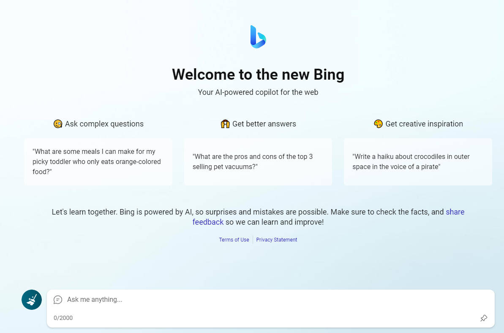
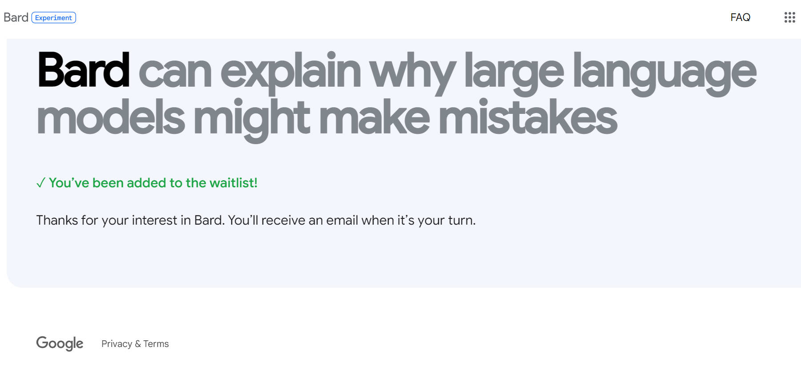
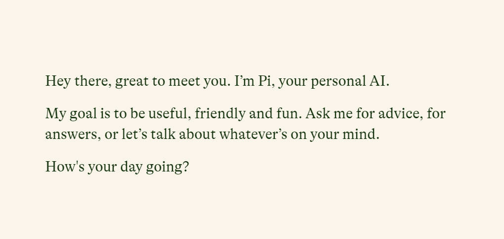
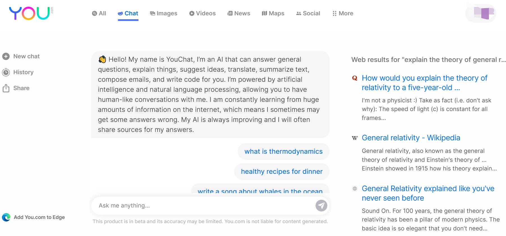
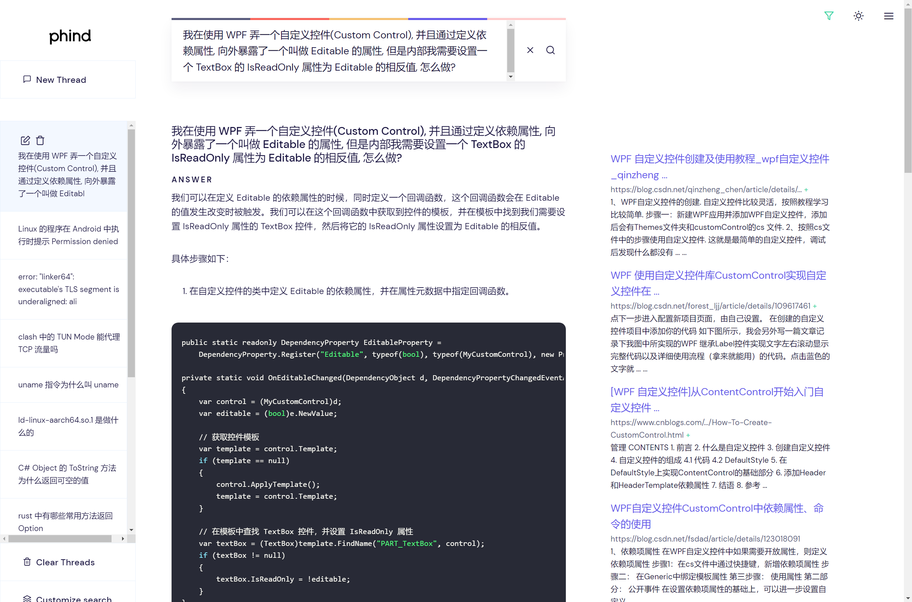
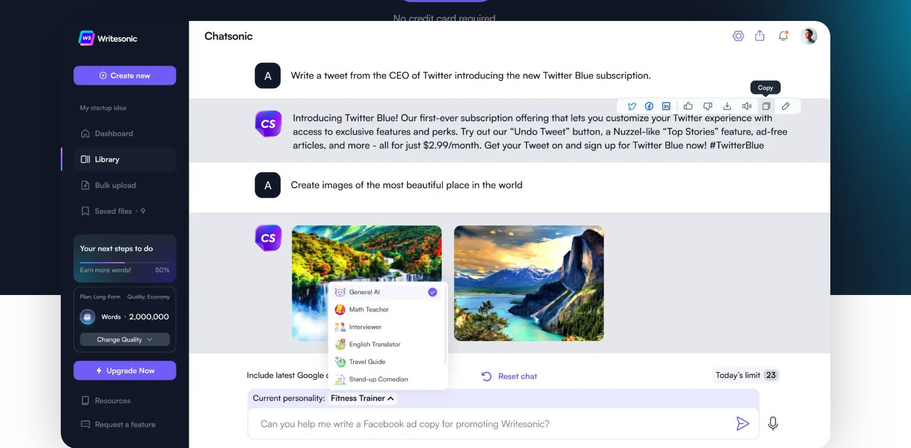
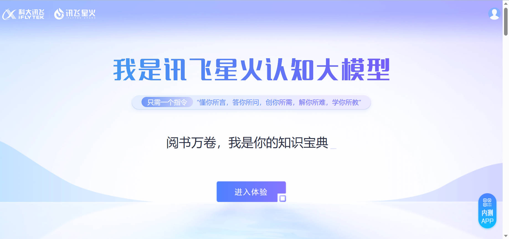

## 使用途径

- [使用途径](#使用途径)
  - [💻 OpenAI 官网](#-openai-官网)
    - [Plus 开通教程](#plus-开通教程)
    - [判断是否为 GPT-4](#判断是否为-gpt-4)
  - [💻 poe](#-poe)
  - [💻 微软必应](#-微软必应)
  - [免费使用 ChatGPT](#免费使用-chatgpt)
  - [💻 第三方 ChatGPT 客户端](#-第三方-chatgpt-客户端)
  - [💻 国外竞品](#-国外竞品)
  - [💻 国产 ChatGPT 类似产品](#-国产-chatgpt-类似产品)

### 💻 [OpenAI 官网](https://ai.com)

(推荐) 注册后免费使用，无次数限制，官方出品，性能最强，技术最佳。缺点是国内注册困难：
* 需要科学上网，使用的代理 IP 质量不好的话无法成功
* 需要国外手机号验证，google voice 等虚拟号码无法通过验证，可使用淘宝解决 or [海外号码](https://sms-activate.org/)
* 国内注册教程及各种问题解决: https://ssw9noe1h6.feishu.cn/wiki/wikcnEeq5F16jdZo7KjmUa1Lh3g

#### Plus 开通教程

有以下三种方法：
* [ChatGPT Plus 最新开通攻略：美区App Store方案（20230529更新）](https://juejin.cn/post/7238423148555812925)
* [nobepay 开卡：](https://zhuanlan.zhihu.com/p/619289623), 【[nobepay 官网](https://www.nobepay.com/)】，【[防止失效备份教程](imgs/nobepay_chatgpt.png)】 技术路线是: RMB -> nobepay 虚拟卡 -> 充值，优点是操作简单，缺点是需要绑定微信手机号等个人信息
* 找有美国卡的朋友代充 或者 [美国代充](https://7t82qtu91d3.typeform.com/to/ZWwsiJDc)

#### 判断是否为 GPT-4
* 西红柿炒钢丝球怎么做。目前只看到 GPT-4 回复说钢丝球不能吃。
* [只有 GPT4 能够回答，非 GPT4 无法回答"的问题收集](https://www.v2ex.com/t/947700)

### 💻 [poe](https://poe.com/chatgpt)

(推荐) 注册后免费使用，可免费试用当前最先进的 GPT-4，提供多种模型选择。能科学上网即可注册，有 iPhone 客户端可以使用。

### 💻 [微软必应](https://www.bing.com/)

(推荐) 注册后免费使用，有次数限制(经常调整)，需要使用微软的 Edge 浏览器访问 www.bing.com, 国内会重定向到 cn.bing.com 导致无法使用。国内使用有两种方法：
* 科学上网访问 www.bing.com
* 重定向访问 www.bing.com
* [国内使用教程](https://juejin.cn/post/7199557716998078522)
* [如果不想使用 Edge 想使用 Chrome 教程](https://cloud.tencent.com/developer/article/2235566)
* [第三方开发者开发的 bing 客户端：BingGPT](https://github.com/dice2o/BingGPT)
  

### 免费使用 ChatGPT 
* [免费的 ChatGPT 镜像网站列表](https://github.com/LiLittleCat/awesome-free-chatgpt)
* [国内可使用ChatGPT镜像站点: carrot](https://github.com/xx025/carrot)
* [可以直接在国内访问的ChatGPT网站](examples/free_chatgpt_website.md)

### 💻 第三方 ChatGPT 客户端

第三方客户端很多，基本都是通过调用 OpenAI 的 API 实现，这些客户端往往需要你自备 OpenAI 的 Api Key 使用。

|名称|Stars|简介|备注|
|---|---|---|---|
|[lencx/ChatGPT](https://github.com/lencx/ChatGPT)||基于 tauri 的跨平台 ChatGPT 客户端, 支持: Windows, Linux, MacOS, 应用内嵌入 ChatGPT 网页.| 需要翻墙。|
|[chatbox](https://github.com/Bin-Huang/chatbox)||开源的ChatGPT桌面应用，prompt 开发神器|全平台支持，下载安装包就能用|
|[Chuanhu ChatGPT](https://github.com/GaiZhenbiao/ChuanhuChatGPT)||为ChatGPT API提供了一个轻快好用的 Web 图形界面|支持直接在Hugging Face上部署，很方便。|
|[ChatGPT-Desktop](https://github.com/Synaptrix/ChatGPT-Desktop)||ChatGPT-Desktop应用|-|
|[ChatGPT-Desktop](https://github.com/ChatGPT-Desktop/ChatGPT-Desktop)||基于 tauri + vue3 开发的跨平台桌面端应用|需要自行准备 API KEY 使用。|

### 💻 国外竞品
<ul>
<li>

  
 💻 Bard 

> https://bard.google.com/
谷歌出品，使用需申请，与 OpenAI ChatGPT 相比不支持代码功能，需翻墙注册使用

</li>

<li>

  
💻 Claude 

> https://www.anthropic.com/product

脱胎于 OpenAI 的初创公司 Anthropic 产品 Claude 模型，需申请使用

更新：Claude 模型现已经可以通过 slack 免费使用，地址: https://www.anthropic.com/claude-in-slack

</li>

  
💻 Pi 

Inflection AI 公司推出的聊天机器人Pi，富有情感的个人定制ChatBot。Inflection AI 是由LinkedIn联合创始人Reid Hoffman和谷歌DeepMind联合创始人Mustafa Suleyman创立的人工智能初创公司。

> https://pi.ai/talk

</li>

<li>

  
💻 YouChat 

  
> https://you.com/

注册登陆后即可免费使用，并且由于 you.com 本身是搜索引擎，侧边栏会出现实时搜索结果

</li>

<li>

  
💻 Phind 

  
> https://phind.com/

无需注册直接使用，并且由于 phind.com 本身是搜索引擎，侧边栏会出现实时搜索结果

</li>

<li>

  
💻 ChatSonic 

  
> https://writesonic.com/chat

注册后提供一定免费额度，超出免费额度需付费

</li>
</ul>

### 💻 国产 ChatGPT 类似产品
<ul>
<li>

  
💻 文心一言

> https://yiyan.baidu.com/welcome

百度出品，可申请使用

</li>

<li>

  
💻 讯飞星火

> https://xinghuo.xfyun.cn/

讯飞出品，中文体验不错，申请简单方便，可申请使用

</li>

<li>

  
💻 通义千问

阿里达摩院出品，目前未大规模开放，可申请使用

</li>

<li>

  
 💻 ChatYuan: 元语功能型对话大模型

  
> https://huggingface.co/spaces/tianpanyu/ChatYuan-Demo

2023 年 2 月曾短暂发布，后因未知原因关闭，现在已经更新升级到 v2 版本，可使用抱抱脸体验 demo, 性能与 OpenAI 的 ChatGPT 有一定差距。代码和模型已开源 [[GitHub 代码](https://github.com/clue-ai/ChatYuan)].

</li>

<li>

  
💻 MOSS 

  
> https://github.com/OpenLMLab/MOSS

MOSS是一个支持中英双语和多种插件的开源对话语言模型，moss-moon系列模型具有160亿参数，在FP16精度下可在单张A100/A800或两张3090显卡运行，在INT4/8精度下可在单张3090显卡运行。MOSS基座语言模型在约七千亿中英文以及代码单词上预训练得到，后续经过对话指令微调、插件增强学习和人类偏好训练具备多轮对话能力及使用多种插件的能力。

开源了模型、训练数据和训练权重，有兴趣的朋友可以本地试用。

</li>

</ul>
