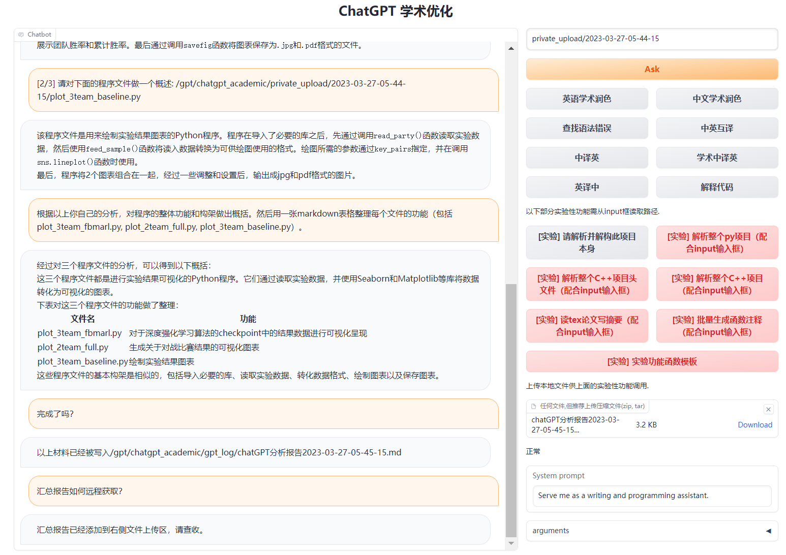
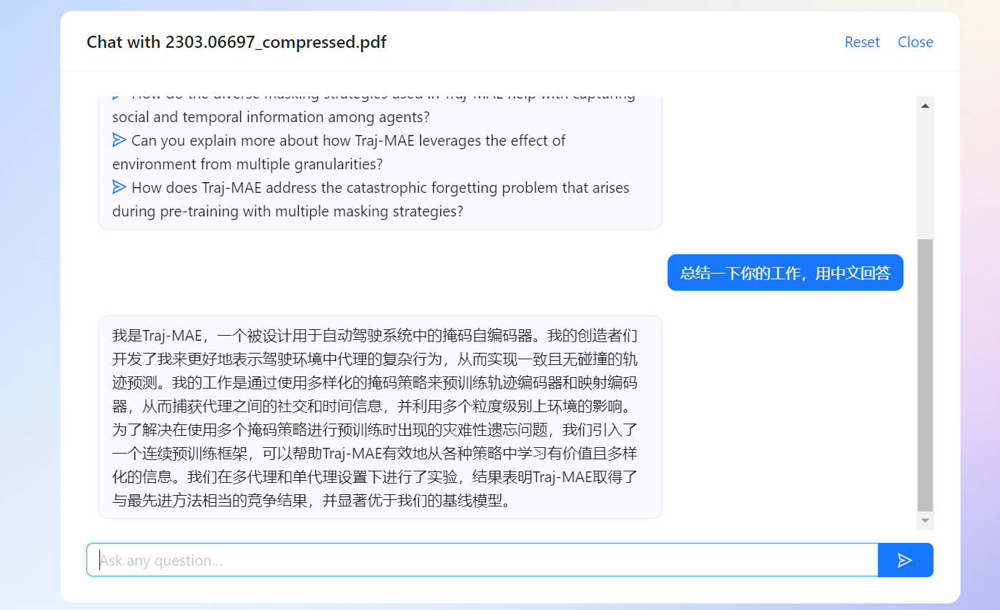
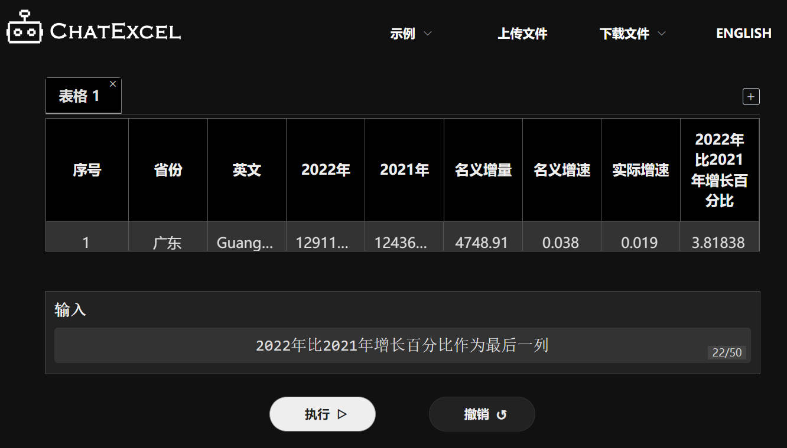
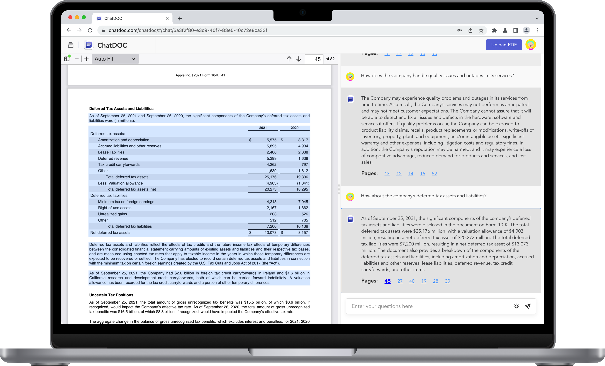
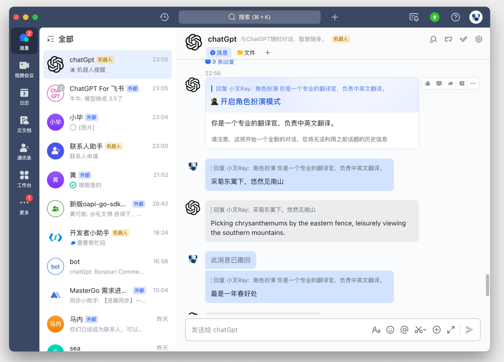
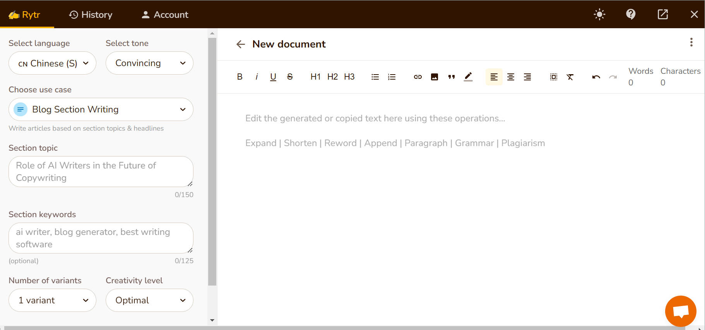
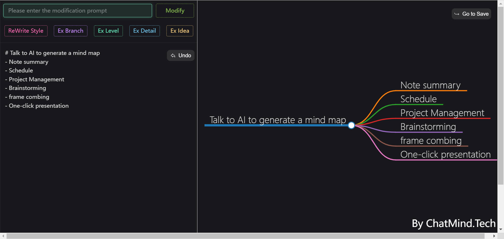
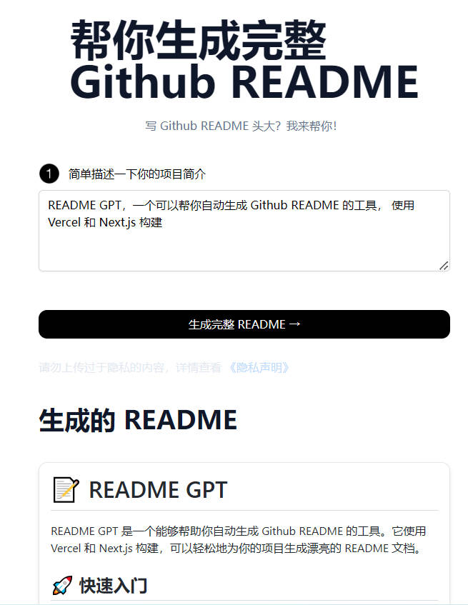
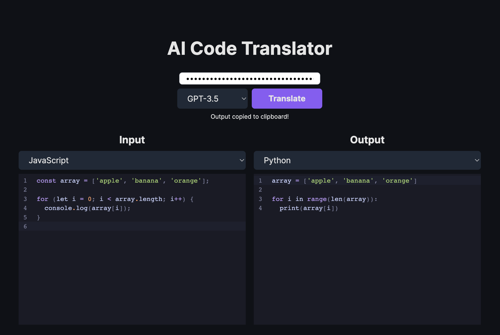

## ChatGPT 工具

- [ChatGPT 工具](#chatgpt-工具)
  - [ChatGPT 学习英语](#chatgpt-学习英语)
  - [翻译: OpenAI Translator](#翻译-openai-translator)
  - [设计梦想的房间: RoomGPT](#设计梦想的房间-roomgpt)
  - [中科院科研工作专用ChatGPT](#中科院科研工作专用chatgpt)
  - [科研狗福音 chatPDF: 像聊天一样阅读 PDF](#科研狗福音-chatpdf-像聊天一样阅读-pdf)
  - [科研助手：researchgpt](#科研助手researchgpt)
  - [通过文字聊天实现 Excel 数据处理：酷表 ChatExcel](#通过文字聊天实现-excel-数据处理酷表-chatexcel)
  - [Doc 文件阅读助手: ChatDoc ](#doc-文件阅读助手-chatdoc-)
  - [跟任何一本书聊天：BookAI](#跟任何一本书聊天bookai)
  - [ChatGPT+飞书给你飞一般的工作体验：feishu-chatgpt ](#chatgpt飞书给你飞一般的工作体验feishu-chatgpt-)
  - [写作助手: rytr](#写作助手-rytr)
  - [与视频对话：ChatYoutube](#与视频对话chatyoutube)
  - [打工人福利: 周报生成器](#打工人福利-周报生成器)
  - [小红书小作文生成器](#小红书小作文生成器)
  - [与文件对话：chatfiles](#与文件对话chatfiles)
  - [提高 ChatGPT 数学能力: WolframAlpha](#提高-chatgpt-数学能力-wolframalpha)
  - [visual ChatGPT](#visual-chatgpt)
  - [Multimedia GPT](#multimedia-gpt)
  - [多模态聊天机器人: genmo](#多模态聊天机器人-genmo)
  - [基于 ChatGPT 创建个人的知识库 AI: Copilot Hub](#基于-chatgpt-创建个人的知识库-ai-copilot-hub)
  - [人工智能医生：ChatDoctor](#人工智能医生chatdoctor)
  - [与AI对话生成思维导图 ChatMind](#与ai对话生成思维导图-chatmind)
  - [自动化企业管理：Auto-GPT](#自动化企业管理auto-gpt)
  - [Meta发布“分割一切”AI模型，CV或迎来GPT-3时刻: SAM](#meta发布分割一切ai模型cv或迎来gpt-3时刻-sam)
  - [支持 ChatGPT 的智能音箱 wukong-robot](#支持-chatgpt-的智能音箱-wukong-robot)
  - [绘图助手 ChartGPT](#绘图助手-chartgpt)
    - [更多应用](#更多应用)
  - [程序猿专区](#程序猿专区)
    - [项目列表](#项目列表)
    - [OpenGPT](#opengpt)
    - [AI代码助手: codeium](#ai代码助手-codeium)
    - [Github Copilot 开源平替，可本地部署: Tabby ](#github-copilot-开源平替可本地部署-tabby-)
    - [将 OpenAI ChatGPT 集成到 VSCode: vscode-chatgpt](#将-openai-chatgpt-集成到-vscode-vscode-chatgpt)
    - [GPT 驱动的代码编辑器: Cursor](#gpt-驱动的代码编辑器-cursor)
    - [帮你生成完整 Github README](#帮你生成完整-github-readme)
    - [智能测试： codium](#智能测试-codium)
    - [shell 中使用 ChatGPT](#shell-中使用-chatgpt)
    - [GitHub 官方出品新一代代码编辑器：copilot-x](#github-官方出品新一代代码编辑器copilot-x)
    - [一键免费部署你的私人 ChatGPT 网页应用: ChatGPT-Next-Web](#一键免费部署你的私人-chatgpt-网页应用-chatgpt-next-web)
    - [将代码从一个语言翻译为另一个语言：ai-code-translator](#将代码从一个语言翻译为另一个语言ai-code-translator)
    - [使用 LLMs 通过自然语言生成任意函数：AI Functions](#使用-llms-通过自然语言生成任意函数ai-functions)
  - [ChatGPT 浏览器插件和小程序](#chatgpt-浏览器插件和小程序)
  - [更多工具](#更多工具)


### ChatGPT 学习英语

直接使用 [speechgpt](https://speechgpt.app/) 或者使用下面 Chrome 插件

* 安装 chrome 插件: [Voice Control for ChatGPT](https://chrome.google.com/webstore/detail/voice-control-for-chatgpt/eollffkcakegifhacjnlnegohfdlidhn)

* 打开 OpenAI ChatGPT 网页，告诉 ChatGPT 你希望它扮演一个 native English speaker 与你对话，并且纠正你的单词、语法错误，插件会自动播放英语语音。


### [翻译: OpenAI Translator](https://chrome.google.com/webstore/detail/openai-translator/ogjibjphoadhljaoicdnjnmgokohngcc?hl=zh-CN)

基于 ChatGPT API 的划词翻译浏览器插件和跨平台桌面端应用。 

[Chrome 插件地址](https://chrome.google.com/webstore/detail/openai-translator/ogjibjphoadhljaoicdnjnmgokohngcc?hl=zh-CN), [GitHub 开源地址](https://github.com/yetone/openai-translator)


### [设计梦想的房间: RoomGPT](https://www.roomgpt.io/)

使用 AI 设计自己梦想的房间，上传图片即可得到概念图。


### [中科院科研工作专用ChatGPT](https://github.com/binary-husky/chatgpt_academic)

中科院科研工作专用ChatGPT，特别优化学术Paper润色体验，支持自定义快捷按钮，支持markdown表格显示，Tex公式双显示，代码显示功能完善，本地Python工程剖析功能/自我剖析

 

### [科研狗福音 chatPDF: 像聊天一样阅读 PDF](https://www.chatpdf.com/)

科研狗福音，上传科研论文 PDF ,可以让 chatPDF 帮助快速总结文章内容，创新点，贡献点，实验结果。以下是一个例子

 

类似工具：
* [PandaGPT](https://www.pandagpt.io/)

### [科研助手：researchgpt](https://github.com/mukulpatnaik/researchgpt)

与上面的 chatPDF 功能比较类似，就不放图了。

[[GitHub 代码](https://github.com/mukulpatnaik/researchgpt)] [[网站](https://researchgpt.ue.r.appspot.com/)]

### [通过文字聊天实现 Excel 数据处理：酷表 ChatExcel](https://chatexcel.com/)

酷表ChatExcel是通过文字聊天实现Excel的交互控制的AI辅助工具，期望通过对表输入需求即可得到处理后的数据（想起来很棒），减少额外的操作，辅助相关工作人员（会计，教师等）更简单的工作。




### [Doc 文件阅读助手: ChatDoc ](https://chatdoc.com/)

基于 ChatGPT 的文件阅读助手，支持中英文，可以快速从上传研究论文、书籍、手册等文件中提取、定位和汇总文件信息，并通过聊天的方式在几秒钟内给出问题的答案。



### [跟任何一本书聊天：BookAI](https://www.bookai.chat/)

输入书名你就可以跟任何一本书聊天。但需要注意背后还是那个会胡编答案的ChatGPT，所以不会 100% 准确地利用这些书籍的知识来跟你对话。估计基于真实图书数据的 ChatGPT 很快就会出现（事实上基于各种真实数据库的各种 chat 都已经在路上了）。


### [ChatGPT+飞书给你飞一般的工作体验：feishu-chatgpt ](https://github.com/Leizhenpeng/feishu-chatgpt)

🎒飞书 ×（GPT-3.5 + DALL·E + Whisper）= 飞一般的工作体验 🚀 语音对话、角色扮演、多话题讨论、图片创作、表格分析、文档导出 🚀




### [写作助手: rytr](https://rytr.me/)

邮件，博客等各类文档智能写作助手，支持中文




### [与视频对话：ChatYoutube](https://chatyoutube.com/)

丢一个 YouTube 视频链接，与任何YouTube视频对话。


### [打工人福利: 周报生成器](https://weeklyreport.avemaria.fun/zh)

生成各种组会、周会汇报内容，周一、五、六、日可免费使用，其余时间需要自备 OpenAI API Key


### [小红书小作文生成器](https://open-gpt.app/app/clf2awmv0001mjt08hjtcpe90)

帮助姐妹们一键生成小作文，在舆论场里立于不败之地。


### [与文件对话：chatfiles](https://github.com/guangzhengli/ChatFiles/blob/main/README.zh.md)

上传文件然后与之对话


### [提高 ChatGPT 数学能力: WolframAlpha](https://huggingface.co/spaces/JavaFXpert/Chat-GPT-LangChain)

ChatGPT 和 Wolfram|Alpha 结合，补足 ChatGPT 数学计算方面的补足。


### [visual ChatGPT](https://huggingface.co/spaces/microsoft/visual_chatgpt)
为 ChatGPT 添加图片能力. 

[论文：[Visual ChatGPT: Talking, Drawing and Editing with Visual Foundation Models
](https://arxiv.org/abs/2303.04671)]  [[GitHub 代码](https://github.com/microsoft/visual-chatgpt)]


### [Multimedia GPT](https://github.com/fengyuli-dev/multimedia-gpt)

将OpenAI GPT与视觉和音频连接起来。您现在可以使用OpenAI API密钥发送图像、音频记录和pdf文档，并获得文本和图像格式的响应。目前正在增加对视频的支持。


### [多模态聊天机器人: genmo](https://www.genmo.ai/)

Genmo Chat 是一款多模态聊天机器人，可以提供文本、图像、视频的内容生成服务，简单来说可以用它来做一些图片和视频编辑工作。

### [基于 ChatGPT 创建个人的知识库 AI: Copilot Hub](https://app.copilothub.co)

Copilot Hub 是一个帮助你基于私有数据创建智能知识库 & 人格化 AI 的平台。你可以基于文档、网站、Notion database 或其他数据源在几分钟内创建一个自定义的 ChatGPT。


### [人工智能医生：ChatDoctor](https://github.com/Kent0n-Li/ChatDoctor)

### [与AI对话生成思维导图 ChatMind](https://www.chatmind.tech/)



### [自动化企业管理：Auto-GPT](https://github.com/Torantulino/Auto-GPT)

使用 GPT-4 实现自动化自主开发和管理企业以实现盈利。

https://user-images.githubusercontent.com/22963551/228855501-2f5777cf-755b-4407-a643-c7299e5b6419.mp4

### [Meta发布“分割一切”AI模型，CV或迎来GPT-3时刻: SAM](https://github.com/facebookresearch/segment-anything)

Meta发布“分割一切”AI模型，CV或迎来GPT-3时刻！多模态 ChatGPT 距离现实应用不远了！

分割作为计算机视觉的核心任务，已经得到广泛应用。但是，为特定任务创建准确的分割模型通常需要技术专家进行高度专业化的工作，此外，该任务还需要大量的领域标注数据，种种因素限制了图像分割的进一步发展。

Meta 发布的 SAM 模型只做了一件事情：（零样本）分割一切。类似 GPT-4 已经做到的“回答一切”。


### [支持 ChatGPT 的智能音箱 wukong-robot](https://github.com/wzpan/wukong-robot)

wukong-robot 是一个简单、灵活、优雅的中文语音对话机器人/智能音箱项目，目的是让中国的 Maker 和 Haker 们也能快速打造个性化的智能音箱。支持ChatGPT多轮对话能力，还可能是第一个开源的脑机唤醒智能音箱。

<a href="https://github.com/wzpan/wukong-robot" rel="wukong-robot"></a>

### [绘图助手 ChartGPT](https://www.chartgpt.dev/)

使用 ChatGPT 帮忙绘制图表，代码已开源。

https://github.com/whoiskatrin/chart-gpt


#### 更多应用

|名称|Stars|简介|备注|
|---|---|---|---|
|[Databerry](https://github.com/gmpetrov/databerry)||将自定义数据连接到大型语言模型的无代码平台。|使用个人数据打造自己的专属 LLMs 助手。支持个人文档、表格等数据上传，不需要自己编程|
|[AudioGPT](https://github.com/AIGC-Audio/AudioGPT)||理解和生成语音，音乐，声音和说话的人头|-|
|[Mr.-Ranedeer-AI-Tutor](https://github.com/JushBJJ/Mr.-Ranedeer-AI-Tutor)||学习助手，解释学习概念，制订学习计划|-|
|[中文法律知识大模型 LaWGPT](https://github.com/pengxiao-song/LaWGPT)||基于中文法律知识的大语言模型|-|
|[PKU-YuanGroup/ChatLaw](https://github.com/PKU-YuanGroup/ChatLaw)||北大出品！中文法律大模型|-|


### 程序猿专区

#### 项目列表

|名称|Stars|简介|备注|
|---|---|---|---|
|[gpt-engineer](https://github.com/AntonOsika/gpt-engineer)||Specify what you want it to build, the AI asks for clarification, and then builds it.|用 GPT 编写整个项目代码！|
|[gpt4free](https://github.com/xtekky/gpt4free)||提供 GPT-4/3.5 的来自各种网站的逆向 API，来自 ChatGPT、poe.com 等各种网站，可以像Openai的官方软件包一样使用。|免费的编程接口！还有 GPT-4 ！不错！|
|[gpt-migrate](https://github.com/0xpayne/gpt-migrate)||Easily migrate your codebase from one framework or language to another.|轻松地将代码库从一个框架或语言迁移到另一个框架或语言。|
|[geekan/MetaGPT](https://github.com/geekan/MetaGPT)||The Multi-Agent Meta Programming Framework: Given one line Requirement, return PRD, Design, Tasks, Repo|多智能体元编程框架：给定老板需求，输出产品文档、架构设计、任务列表、代码|
|[chatgpt-on-wechat](https://github.com/zhayujie/chatgpt-on-wechat)||使用ChatGPT搭建微信聊天机器人|-|
|[AI-For-Beginners](https://github.com/microsoft/AI-For-Beginners)||12 Weeks, 24 Lessons, AI for All!|微软为新人推出的 AI 学习课程|
|[ChatBot-UI](https://github.com/mckaywrigley/chatbot-ui)||搭建属于自己的 ChatGPT 网站|需要使用 API KEY|
|[chatgpt-mirai-qq-bot](https://github.com/lss233/chatgpt-mirai-qq-bot)||🚀 一键部署！真正的 AI 聊天机器人！支持ChatGPT、文心一言、讯飞星火、Bing、Bard、ChatGLM、POE，多账号，人设调教，虚拟女仆、图片渲染、语音发送 | 支持 QQ、Telegram、Discord、微信 等平台|
|[CopilotForXcode](https://github.com/intitni/CopilotForXcode)||Copilot Xcode Source Editor Extension|-|
|[GPTcommit](https://github.com/zurawiki/gptcommit)||以后 git 提交 commit 信息不用抓耳挠腮了|-|
|[opencommit](https://github.com/di-sukharev/opencommit)||用命令自动生成令人印象深刻的 commit|-|
|[AutoDoc-ChatGPT](https://github.com/awekrx/AutoDoc-ChatGPT)||自动生成任何编程语言的文档|-|
|[awesome-totally-open-chatgpt](https://github.com/nichtdax/awesome-totally-open-chatgpt)||开源 ChatGPT 替代品列表|-|
|[AI Anything](https://github.com/KeJunMao/ai-anything/blob/main/README.zh-cn.md)||人人都能创建 GPT 工具|-|
|[Portal](https://github.com/lxfater/Portal) ||Portal是一款传输工具，旨在将ChatGPT的能力整合到用户的工作流程中。它把整个操作系统当成自己的舞台，可以在任意软件上操作ChatGPT。|在任意软件上操作ChatGPT|
|[SQL Chat](https://github.com/sqlchat/sqlchat)||通过聊天生成 SQL 操作数据库|-|
|[Chatgpt-Telegram-bot](https://github.com/n3d1117/chatgpt-telegram-bot)||电报 ChatGPT 机器人|-|
|[engshell](https://github.com/emcf/engshell)||LLMs 驱动的操作系统的 Shell|-|
|[CodeWhisperer](https://aws.amazon.com/codewhisperer/)|-|免费，支持中文的 AI 代码助手，注册教程如下：官方地址：https://aws.amazon.com/codewhisperer/ 知乎保姆级教程：https://zhuanlan.zhihu.com/p/621800084|-|
|[bloop](https://github.com/BloopAI/bloop)||bloop是一个用Rust编写的快速代码搜索引擎。|基于ChatGPT,和代码对话！|
|[WebGPT](https://github.com/0hq/WebGPT)||WebGPT 是基于浏览器 WebGPU 能力打造的在流量器运行 GPT 模型的应用|未来可期~|
|[PentestGPT](https://github.com/GreyDGL/PentestGPT)||基于 GPT 能力的渗透测试工具|-|
|[ChatGPT.nvim](https://github.com/jackMort/ChatGPT.nvim)||ChatGPT Neovim Plugin: Effortless Natural Language Generation with OpenAI's ChatGPT API.|-|
|[assafelovic/gpt-researcher](https://github.com/assafelovic/gpt-researcher)||GPT based autonomous agent that does online comprehensive research on any given topic|-|
|[SkalskiP/awesome-chatgpt-code-interpreter-experiments](https://github.com/SkalskiP/awesome-chatgpt-code-interpreter-experiments)||Awesome things you can do with ChatGPT + Code Interpreter combo 🔥|-|
|[gpt-runner](https://github.com/nicepkg/gpt-runner)||-|管理 AI 预设，与代码文件聊天，提升开发效率！|
|[jupyter-ai](https://github.com/jupyterlab/jupyter-ai)||A generative AI extension for JupyterLab | JupyterLab 的人工智能生成扩展！|
|[MetaGPT](https://github.com/geekan/MetaGPT)||The Multi-Agent Framework: Given one line Requirement, return PRD, Design, Tasks, Repo. | MetaGPT输入一句话的老板需求，输出用户故事 / 竞品分析 / 需求 / 数据结构 / APIs / 文件等！|


#### [OpenGPT](https://open-gpt.app/)

立即使用海量的 ChatGPT 应用，或在几秒钟内创建属于自己的应用。


#### [AI代码助手: codeium](https://codeium.com/)
个人使用免费，有 vscode 插件，github copilot 平替


#### [Github Copilot 开源平替，可本地部署: Tabby ](https://github.com/TabbyML/tabby)

#### [将 OpenAI ChatGPT 集成到 VSCode: vscode-chatgpt](https://github.com/gencay/vscode-chatgpt)

#### [GPT 驱动的代码编辑器: Cursor](https://www.cursor.so/)

GPT-4 驱动的一款强大代码编辑器，可以辅助程序员进行日常的编码，目前免费。


#### [帮你生成完整 Github README](https://readme.rustc.cloud/zh)
简单描述项目简介即可快速生成 GitHub README 内容



#### [智能测试： codium](https://www.codium.ai/)

CodiumAI这个项目构建了一个名为TestGPT的语言模型，是一个专注于软件测试方面的AI，用它通过对话式来生成代码分析、测试计划和测试代码。目前有vscode和jetbrains的插件可供使用。


#### [shell 中使用 ChatGPT](https://github.com/TheR1D/shell_gpt)


#### [GitHub 官方出品新一代代码编辑器：copilot-x](https://github.com/features/preview/copilot-x)

目前可申请内测


#### [一键免费部署你的私人 ChatGPT 网页应用: ChatGPT-Next-Web](https://github.com/Yidadaa/ChatGPT-Next-Web)


#### [将代码从一个语言翻译为另一个语言：ai-code-translator](https://github.com/mckaywrigley/ai-code-translator)




#### [使用 LLMs 通过自然语言生成任意函数：AI Functions](https://www.askmarvin.ai/)

使用 OpenAI GPT4, 描述函数功能即刻得到相应的函数代码，使用 GPT4 替代程序猿更近一步了，下面是核心代码：

[GitHub 开源实现：AI-Functions](https://github.com/Torantulino/AI-Functions)

```
import openai

def ai_function(function, args, description, model = "gpt-4"):
    # parse args to comma seperated string
    args = ", ".join(args)
    messages = [{"role": "system", "content": f"You are now the following python function: ```# {description}\n{function}```\n\nOnly respond with your `return` value. no verbose, no chat."},{"role": "user", "content": args}]

    response = openai.ChatCompletion.create(
        model=model,
        messages=messages,
        temperature=0
    )

    return response.choices[0].message["content"]
```


### ChatGPT 浏览器插件和小程序
* [ChatGPT Sidebar](https://www.chatgpt-sidebar.com/)

Chat-GPT 超级挂件，以侧边窗口的形式提供服务，可以在阅读书籍时划选文本点击按钮给你解释，总结和提取；也可以在使用笔记软件时为笔记润色，翻译和补充.....


* [ChatGPT 接入谷歌: chatgpt-google-extension](https://chatgpt4google.com/)
* [使用 GPT-4 实现浏览器自动化: TaxyAI](https://github.com/TaxyAI/browser-extension)
* [ChatGPT 协助回答知乎问题: chat-gpt-zhihu-extension](https://chrome.google.com/webstore/detail/chatgpt-for-zhihu/dgoinfidjelfolhnkaableghhppplbak)
* [邮件助手：ChatGPT for Email - Remail](https://chrome.google.com/webstore/detail/chatgpt-for-email-remail/jjplpolfahlhoodebebfjdbpcbopcmlk)
* [分享你与 ChatGPT 的对话：ShareGPT](https://github.com/domeccleston/sharegpt)
* [让 ChatGPT 联网: WebChatGPT](https://github.com/qunash/chatgpt-advanced)

### 更多工具

[ChatGPT 用法和 APP](https://gpt3demo.com/)

[一个十分全面的 AI 工具合集文档](https://bytedance.feishu.cn/base/AIMAbnJxQaNgSGsBAtwcdAkLnvf)